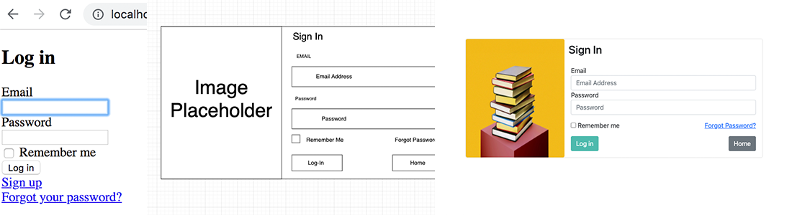

# UCCS - CS 3300 Iteration 6

# Description:

---
**This is your chance to exercise your creative freedom and design and learn on your own.**

In this assignment, you are going to continue working on your individual portfolio software project. Using the wireframe
sketches that you created earlier in the semester, you will start implementing your ideas and creating the HTML and CSS
web pages to display information for users to view. <br>

### _Important  Note:_

---
If you change the way that you design the front-end of your website, please update and resubmit your wireframe diagram
corresponding to your changes. <br>

**Purpose:** Learn how to use wireframe design documents to create HTML & CSS based web-applications.<br>
**Effort:** Individual <br>
**Points:** <br>
**Deliverables:** .DOCX, .PDF, and other text-based document formats.

```diff 
- No compressed (.zip, .tar, etc.) will be accepted, make sure that all deliverables
- are all in one submission file.
 ```

## Expected Deliverables:

---
[//]: # (This deliverable is critical and MUST be included)
**[ 7 Points ]:** Link to your GitHub Repository containing all updated and working code.<br>

[//]: # (21 total points: 15 total points for each set of deliverables, there should be 3 images)
**[ 1  Point each ]:** start image for each view (Index, New Session, Registration). <br>
**[ 1  Point each ]:** Wireframe image from iteration 02 for each view (New, Show Edit). <br>
**[ 5 Points each ]:** Completed code for each view (Index, New Session, Registration). <br>

[//]: # (15 points for the write up)
**[ 5  Points ]:** 3 References or links that helped you. <br>
**[ 1 Points ]:** Provided HTML code with simple explanation.
**[ 1 Points ]:** Provided HTML code with simple explanation.
**[ 5 Points ]:** Response Paragraph. <br>

# Instructions:

---

1. Generate the views associated with devise by running the following command. <br>
   `rails generate devise:views users`


2. In <PORTFOLIO PROJECT>/config/initializer/devise.rb, Uncomment the following.
    `# config.scoped_views = false`


3. Change the same variable from `false` to `true`.


4. You will be modifying the following 3 views to look like the wireframe diagrams that you created in iteration 02 earlier in the semester. <br>
   ```diff
   + Remember to push your code changes to GitHub early and often so that you avoid losing completed work.
   ```
    1. Portfolio "Home/ Index" View <br>
       **NOTE:** You can choose to edit either of the index pages that we have created in this class, just make sure that 
        one of them is linked as your homepage in the /config/routes.rb file.
            - \<PORTFOLIO PROJECT\>/app/views/home/**index.html.erb** <br>
    2. User "Registration/ Sign Up" View <br>            
        - \<PORTFOLIO PROJECT\>/app/views/users/registrations/new.html.erg <br>
    3. User "Login" View <br>           
        - \<PORTFOLIO PROJECT\>/app/views/users/sessions/**new.html.erb** <br>


5. Take a screenshot of each initial view to show your starting point.


6. Modify the HTML and CSS code for each of the views and push your code to GitHub when complete.<br>


7. Take a second screenshot of your finalized views to show your progress.

### _**Example Submission:**_



# Response Questions & Deliverables:

---
1. Provide a link to your GitHub Repository with all of your changes. Make sure this repository is public.


2. Provide a screenshot of the following for all 3 of the views that you made changes to (Should be 9 total screenshots):
    1. Your wireframe diagram for each view (you created this in iteration 02.)
    2. What the view looks like before you make changes.
    3. What the view looks like after your changes have been made.


2. Provide a <ins> **small**</ins> portion of your HTML Code and give an explanation of what HTML tags you used, and how you
   structured your code.


3. Provide a <ins> **small**</ins> portion of your CSS Code and give an explanation of what the styling accomplishes.


4. Provide **3** references that helped you learn something or solve a problem.


5. Write a short summary about what you have learned in this iteration and what skills you can take with you into future <br>
classes/ the rest of your degree.


